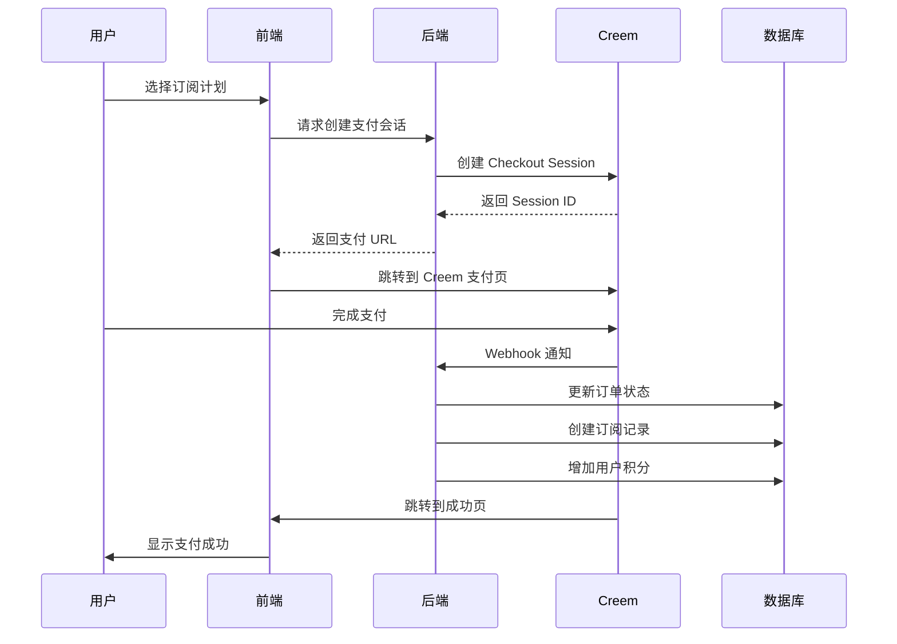

# 📝 Creem 支付配置指南

## 一、Creem 产品配置清单

### 1.1 基础会员产品 (Basic Plan)

#### 月付产品配置
```yaml
产品名称: AI Universal Generator - Basic Monthly
产品ID: ai_generator_basic_monthly
价格: $9.00 USD
计费周期: 月付 (Monthly)
货币: USD
描述: |
  基础会员月付套餐
  - 100 积分/月
  - GPT-3.5 & GPT-4 访问
  - 基础图片生成
  - Email 支持
  - 无水印输出
```

#### 年付产品配置
```yaml
产品名称: AI Universal Generator - Basic Yearly
产品ID: ai_generator_basic_yearly
价格: $90.00 USD (原价 $108，优惠 17%)
计费周期: 年付 (Yearly)
货币: USD
描述: |
  基础会员年付套餐（节省17%）
  - 100 积分/月
  - 所有月付权益
  - 额外赠送 200 积分
```

### 1.2 专业会员产品 (Pro Plan)

#### 月付产品配置
```yaml
产品名称: AI Universal Generator - Pro Monthly
产品ID: ai_generator_pro_monthly
价格: $29.00 USD
计费周期: 月付 (Monthly)
货币: USD
描述: |
  专业会员月付套餐
  - 500 积分/月
  - GPT-4 无限访问
  - 高级图片生成
  - 视频生成（限量）
  - API 访问（限速）
  - 优先队列
  - 优先支持
```

#### 年付产品配置
```yaml
产品名称: AI Universal Generator - Pro Yearly
产品ID: ai_generator_pro_yearly
价格: $290.00 USD (原价 $348，优惠 17%)
计费周期: 年付 (Yearly)
货币: USD
描述: |
  专业会员年付套餐（节省17%）
  - 500 积分/月
  - 所有月付权益
  - 额外赠送 1000 积分
  - 免费升级新功能
```

### 1.3 企业会员产品 (Enterprise Plan)

#### 月付产品配置
```yaml
产品名称: AI Universal Generator - Enterprise Monthly
产品ID: ai_generator_enterprise_monthly
价格: $99.00 USD
计费周期: 月付 (Monthly)
货币: USD
描述: |
  企业会员月付套餐
  - 2000 积分/月
  - 无限 AI 模型访问
  - 无限视频生成
  - API 无限访问
  - 专属服务器
  - 自定义模型
  - 专属客户经理
  - SLA 保证
  - 5个团队席位
```

#### 年付产品配置
```yaml
产品名称: AI Universal Generator - Enterprise Yearly
产品ID: ai_generator_enterprise_yearly
价格: $990.00 USD (原价 $1188，优惠 17%)
计费周期: 年付 (Yearly)
货币: USD
描述: |
  企业会员年付套餐（节省17%）
  - 2000 积分/月
  - 所有月付权益
  - 额外赠送 5000 积分
  - 白标定制
  - 优先技术支持
```

### 1.4 一次性充值产品

```yaml
# 小额充值
产品名称: 100 Credits Pack
产品ID: credits_pack_100
价格: $5.00 USD
类型: 一次性 (One-time)
描述: 100 积分包

# 中额充值
产品名称: 500 Credits Pack
产品ID: credits_pack_500
价格: $20.00 USD
类型: 一次性 (One-time)
描述: 500 积分包（额外赠送 50 积分）

# 大额充值
产品名称: 2000 Credits Pack
产品ID: credits_pack_2000
价格: $70.00 USD
类型: 一次性 (One-time)
描述: 2000 积分包（额外赠送 300 积分）
```

## 二、Creem Webhook 配置

### 2.1 Webhook URL 设置

```bash
# 生产环境
Webhook URL: https://{{PRODUCTION_DOMAIN}}/api/pay/notify/creem
Webhook Secret: [在 Creem 后台生成]

# 测试环境
Test Webhook URL: https://{{STAGING_DOMAIN}}/api/pay/notify/creem
Test Mode: Enabled
```

### 2.2 Webhook 事件订阅

需要订阅的事件：
- ✅ `payment.succeeded` - 支付成功
- ✅ `payment.failed` - 支付失败
- ✅ `subscription.created` - 订阅创建
- ✅ `subscription.updated` - 订阅更新
- ✅ `subscription.cancelled` - 订阅取消
- ✅ `subscription.renewed` - 订阅续费
- ✅ `refund.created` - 退款创建
- ✅ `refund.succeeded` - 退款成功

## 三、回调 URL 配置

### 3.1 支付成功页面
```
Success URL: https://{{PRODUCTION_DOMAIN}}/pay-success?session_id={CHECKOUT_SESSION_ID}
```

### 3.2 支付取消页面
```
Cancel URL: https://{{PRODUCTION_DOMAIN}}/pricing?cancelled=true
```

### 3.3 支付失败页面
```
Failure URL: https://{{PRODUCTION_DOMAIN}}/pay-error?error={ERROR_CODE}
```

## 四、环境变量配置

在 `.env.local` 或 `.env.production` 中添加：

```env
# Creem 支付配置
CREEM_API_KEY=your_creem_api_key_here
CREEM_WEBHOOK_SECRET=your_webhook_secret_here
CREEM_MERCHANT_ID=your_merchant_id_here

# Creem 产品 ID 映射
CREEM_PRODUCT_BASIC_MONTHLY=ai_generator_basic_monthly
CREEM_PRODUCT_BASIC_YEARLY=ai_generator_basic_yearly
CREEM_PRODUCT_PRO_MONTHLY=ai_generator_pro_monthly
CREEM_PRODUCT_PRO_YEARLY=ai_generator_pro_yearly
CREEM_PRODUCT_ENTERPRISE_MONTHLY=ai_generator_enterprise_monthly
CREEM_PRODUCT_ENTERPRISE_YEARLY=ai_generator_enterprise_yearly

# Creem 积分包产品 ID
CREEM_CREDITS_100=credits_pack_100
CREEM_CREDITS_500=credits_pack_500
CREEM_CREDITS_2000=credits_pack_2000
```

## 五、数据库产品映射

### 5.1 产品 ID 与订阅计划映射

```javascript
const PRODUCT_PLAN_MAPPING = {
  // Basic Plans
  'ai_generator_basic_monthly': {
    plan_id: 'basic',
    plan_name: 'Basic Plan',
    interval: 'monthly',
    credits: 100,
    price: 900, // $9.00 in cents
  },
  'ai_generator_basic_yearly': {
    plan_id: 'basic',
    plan_name: 'Basic Plan',
    interval: 'yearly',
    credits: 100,
    price: 9000, // $90.00 in cents
    bonus_credits: 200,
  },
  
  // Pro Plans
  'ai_generator_pro_monthly': {
    plan_id: 'pro',
    plan_name: 'Pro Plan',
    interval: 'monthly',
    credits: 500,
    price: 2900, // $29.00 in cents
  },
  'ai_generator_pro_yearly': {
    plan_id: 'pro',
    plan_name: 'Pro Plan',
    interval: 'yearly',
    credits: 500,
    price: 29000, // $290.00 in cents
    bonus_credits: 1000,
  },
  
  // Enterprise Plans
  'ai_generator_enterprise_monthly': {
    plan_id: 'enterprise',
    plan_name: 'Enterprise Plan',
    interval: 'monthly',
    credits: 2000,
    price: 9900, // $99.00 in cents
  },
  'ai_generator_enterprise_yearly': {
    plan_id: 'enterprise',
    plan_name: 'Enterprise Plan',
    interval: 'yearly',
    credits: 2000,
    price: 99000, // $990.00 in cents
    bonus_credits: 5000,
  },
  
  // Credit Packs
  'credits_pack_100': {
    type: 'credits',
    credits: 100,
    price: 500, // $5.00 in cents
  },
  'credits_pack_500': {
    type: 'credits',
    credits: 550, // 500 + 50 bonus
    price: 2000, // $20.00 in cents
  },
  'credits_pack_2000': {
    type: 'credits',
    credits: 2300, // 2000 + 300 bonus
    price: 7000, // $70.00 in cents
  },
};
```

## 六、Creem Dashboard 设置步骤

### Step 1: 创建产品
1. 登录 Creem Dashboard
2. 进入 Products → Create Product
3. 填写产品信息（参考上述配置）
4. 设置价格和计费周期
5. 保存产品 ID

### Step 2: 配置 Webhook
1. 进入 Settings → Webhooks
2. 添加 Webhook endpoint
3. 输入 Webhook URL
4. 选择要订阅的事件
5. 保存并获取 Webhook Secret

### Step 3: 设置支付页面
1. 进入 Checkout → Settings
2. 配置成功/失败跳转 URL
3. 自定义支付页面样式
4. 设置支持的支付方式

### Step 4: 测试支付流程
1. 使用测试模式
2. 使用测试卡号：4242 4242 4242 4242
3. 验证 Webhook 接收
4. 检查订单创建和积分发放

## 七、支付流程图



## 八、注意事项

### 8.1 安全要求
- ✅ 验证 Webhook 签名
- ✅ 使用 HTTPS
- ✅ 不在前端暴露 API Key
- ✅ 实现幂等性处理

### 8.2 错误处理
- 支付失败重试机制
- Webhook 失败重发处理
- 订阅续费失败通知
- 积分发放失败补偿

### 8.3 测试检查清单
- [ ] 测试月付订阅购买
- [ ] 测试年付订阅购买
- [ ] 测试积分包购买
- [ ] 测试订阅续费
- [ ] 测试订阅取消
- [ ] 测试退款流程
- [ ] 测试 Webhook 接收
- [ ] 测试支付失败处理

## 九、常见问题

### Q1: 如何处理重复的 Webhook？
实现幂等性，通过 order_no 判断是否已处理。

### Q2: 订阅续费失败怎么办？
1. 发送邮件通知用户
2. 给予 3 天宽限期
3. 降级为免费用户

### Q3: 如何实现订阅升级/降级？
1. 取消当前订阅
2. 创建新订阅
3. 按比例退还/补差价

### Q4: 如何处理退款？
1. 接收退款 Webhook
2. 扣除相应积分
3. 更新订单状态
4. 通知用户

---

**文档版本**: 1.0  
**更新日期**: 2025-08-15  
**维护团队**: AI Universal Generator Team

## 附录：快速复制模板

### Creem 产品创建模板

```json
{
  "name": "AI Universal Generator - [TIER] [INTERVAL]",
  "product_id": "ai_generator_[tier]_[interval]",
  "price": {
    "amount": [AMOUNT_IN_CENTS],
    "currency": "USD"
  },
  "billing": {
    "type": "subscription|one_time",
    "interval": "monthly|yearly|once"
  },
  "metadata": {
    "plan_id": "[tier]",
    "credits": [CREDITS_AMOUNT],
    "features": "[FEATURES_LIST]"
  }
}
```