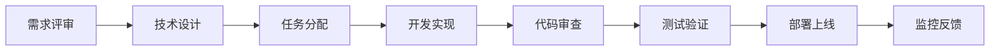

# Character Figure AI Generator 开发计划与分工

## 📋 执行概要

**项目代号**: CharFig AI  
**开发周期**: 6周（MVP 2周 + 功能完善 2周 + 商业化 2周）  
**团队规模**: 3-5人  
**预算估算**: ¥50,000 - ¥100,000

## 🎯 Sprint 规划

### Sprint 1: 核心功能开发 (第1周)

#### 前端任务
| 任务 | 负责人 | 工时 | 优先级 | 完成标准 |
|-----|-------|------|--------|---------|
| 项目初始化与配置 | 前端A | 4h | P0 | Next.js项目运行正常 |
| 创建基础布局组件 | 前端A | 8h | P0 | Header/Footer/Layout完成 |
| 实现图片上传组件 | 前端A | 8h | P0 | 支持拖拽和点击上传 |
| 设计风格选择器 | 前端B | 6h | P0 | 7种风格卡片选择 |
| 开发参数调节面板 | 前端B | 8h | P1 | 滑块、下拉框组件 |
| 创建提示词输入框 | 前端A | 6h | P0 | 支持中英文输入 |

#### 后端任务
| 任务 | 负责人 | 工时 | 优先级 | 完成标准 |
|-----|-------|------|--------|---------|
| 数据库架构设计 | 后端 | 4h | P0 | Schema定义完成 |
| 用户认证系统 | 后端 | 8h | P0 | NextAuth配置成功 |
| nano-banana API集成 | 后端 | 8h | P0 | 生成接口可用 |
| 图片上传接口 | 后端 | 6h | P0 | 支持R2存储 |
| 积分系统基础 | 后端 | 6h | P1 | 扣费逻辑实现 |

### Sprint 2: MVP完成 (第2周)

#### 集成测试阶段
| 任务 | 负责人 | 工时 | 优先级 | 完成标准 |
|-----|-------|------|--------|---------|
| 前后端联调 | 全栈 | 16h | P0 | 完整流程可用 |
| UI响应式适配 | 前端A | 8h | P0 | 移动端体验良好 |
| 生成队列管理 | 后端 | 8h | P0 | 并发处理正常 |
| 错误处理优化 | 全栈 | 8h | P0 | 友好错误提示 |
| 性能优化 | 全栈 | 8h | P1 | 首屏<3秒 |
| 部署上线 | DevOps | 4h | P0 | Vercel部署成功 |

### Sprint 3: 用户体验优化 (第3周)

#### 功能增强
| 功能模块 | 子任务 | 负责人 | 工时 | 备注 |
|---------|--------|-------|------|------|
| **画廊系统** | | | | |
| | 瀑布流布局 | 前端A | 8h | Masonry组件 |
| | 作品详情页 | 前端B | 6h | 展示元数据 |
| | 点赞收藏功能 | 全栈 | 8h | 实时更新 |
| **历史记录** | | | | |
| | 生成历史列表 | 前端A | 6h | 分页加载 |
| | 重新生成功能 | 后端 | 4h | 参数复用 |
| **批量处理** | | | | |
| | 多图上传UI | 前端B | 8h | 进度显示 |
| | 队列可视化 | 前端A | 6h | 实时状态 |

### Sprint 4: 社交功能 (第4周)

#### 社区建设
| 功能 | 描述 | 负责人 | 预计工时 |
|------|------|--------|----------|
| 用户主页 | 个人作品展示 | 前端A | 12h |
| 关注系统 | 用户间关注 | 全栈 | 16h |
| 评论系统 | 作品评论 | 全栈 | 12h |
| 分享功能 | 社交媒体分享 | 前端B | 8h |
| 通知中心 | 消息提醒 | 全栈 | 12h |

### Sprint 5: 商业化功能 (第5周)

#### 支付与会员
| 模块 | 任务清单 | 负责人 | 工时 |
|------|---------|--------|------|
| **支付集成** | | | |
| | Stripe配置 | 后端 | 8h |
| | 支付页面UI | 前端A | 8h |
| | Webhook处理 | 后端 | 6h |
| **会员系统** | | | |
| | 会员等级设计 | 产品 | 4h |
| | 权限控制 | 后端 | 8h |
| | 会员中心页面 | 前端B | 8h |
| **积分商城** | | | |
| | 积分充值 | 全栈 | 8h |
| | 积分消耗记录 | 后端 | 6h |

### Sprint 6: 优化与发布 (第6周)

#### 上线准备
- [ ] 全面测试（功能、性能、安全）
- [ ] SEO优化（Meta标签、Sitemap）
- [ ] 监控配置（错误追踪、性能监控）
- [ ] 文档编写（用户手册、API文档）
- [ ] 营销准备（落地页、宣传素材）

## 👥 团队组成与职责

### 核心团队配置

```yaml
技术负责人 (1人):
  职责:
    - 技术架构设计
    - 代码审查
    - 技术难点攻关
    - 团队技术指导
  要求:
    - 5年+全栈开发经验
    - 精通Next.js/Node.js
    - 有AI项目经验

前端工程师 (2人):
  前端A (高级):
    - 核心组件开发
    - 性能优化
    - 架构设计
  前端B (中级):
    - UI组件实现
    - 页面开发
    - 样式优化

后端工程师 (1人):
  职责:
    - API开发
    - 数据库设计
    - 第三方集成
    - 安全防护
  要求:
    - 精通Node.js
    - 熟悉PostgreSQL
    - 了解AI API

产品经理 (1人):
  职责:
    - 需求管理
    - 用户调研
    - 数据分析
    - 项目协调
```

### 协作模式

#### 开发流程


#### 沟通机制
- **每日站会**: 15分钟，同步进度
- **周度评审**: 演示本周成果
- **技术分享**: 每周五技术讨论
- **文档沉淀**: Notion协作文档

## 🛠 技术实施细节

### 开发环境配置

```bash
# 1. 克隆项目
git clone git@github.com:wegnite/nano-banana.git
cd nano-banana

# 2. 安装依赖
pnpm install

# 3. 环境变量配置
cp .env.example .env.local
# 编辑 .env.local 添加必要的API密钥

# 4. 数据库初始化
pnpm db:push
pnpm db:generate

# 5. 启动开发服务器
pnpm dev
```

### 代码规范

```javascript
// 文件命名规范
components/
  CharacterFigure/
    CharacterFigure.tsx       // 组件主文件
    CharacterFigure.module.css // 样式文件
    CharacterFigure.test.tsx  // 测试文件
    index.ts                  // 导出文件

// 组件编写规范
export const CharacterFigureGenerator: FC<Props> = ({ 
  onGenerate,
  initialPrompt 
}) => {
  // 1. Hooks声明
  const [loading, setLoading] = useState(false);
  
  // 2. 事件处理
  const handleSubmit = useCallback(async () => {
    // 处理逻辑
  }, []);
  
  // 3. 渲染逻辑
  return (
    <div className={styles.container}>
      {/* JSX内容 */}
    </div>
  );
};

// API路由规范
export async function POST(request: Request) {
  try {
    // 1. 参数验证
    const body = await request.json();
    const validated = schema.parse(body);
    
    // 2. 业务逻辑
    const result = await generateImage(validated);
    
    // 3. 返回响应
    return NextResponse.json({ 
      success: true, 
      data: result 
    });
  } catch (error) {
    // 4. 错误处理
    return NextResponse.json(
      { success: false, error: error.message },
      { status: 400 }
    );
  }
}
```

### Git工作流

```bash
# 分支策略
main          # 生产环境
├── develop   # 开发环境
    ├── feature/image-upload    # 功能分支
    ├── feature/gallery        # 功能分支
    └── fix/generation-error   # 修复分支

# 提交规范
feat: 添加图片上传功能
fix: 修复生成失败问题
docs: 更新README文档
style: 格式化代码
refactor: 重构生成逻辑
test: 添加单元测试
chore: 更新依赖包
```

## 📊 项目追踪

### 里程碑检查点

| 里程碑 | 日期 | 完成标准 | 负责人 |
|--------|------|----------|--------|
| MVP上线 | Week 2末 | 核心功能可用 | 技术负责人 |
| 用户测试 | Week 3末 | 100+用户反馈 | 产品经理 |
| 付费功能 | Week 5末 | 支付流程通畅 | 后端工程师 |
| 正式发布 | Week 6末 | 全功能上线 | 全体 |

### 风险管理

| 风险项 | 概率 | 影响 | 缓解措施 |
|--------|------|------|----------|
| API限流 | 高 | 高 | 多供应商备份方案 |
| 生成质量不稳定 | 中 | 高 | Prompt优化+测试 |
| 支付集成延期 | 低 | 中 | 提前准备文档 |
| 用户增长缓慢 | 中 | 中 | 加强营销推广 |

### 质量保证

```yaml
代码质量:
  - ESLint规则强制
  - 代码审查必须
  - 测试覆盖率>80%

性能指标:
  - 首屏加载<3秒
  - API响应<500ms
  - 生成时间<10秒

安全要求:
  - 输入验证
  - SQL注入防护
  - XSS防护
  - CSRF防护
```

## 🚀 快速启动指南

### Day 1 任务清单

**前端开发者**:
```bash
# 1. 设置开发环境
pnpm create next-app --typescript

# 2. 安装核心依赖
pnpm add @shadcn/ui framer-motion

# 3. 创建基础组件
- components/Layout.tsx
- components/ImageUploader.tsx
- components/StyleSelector.tsx

# 4. 实现首页布局
- app/page.tsx
- app/generate/page.tsx
```

**后端开发者**:
```bash
# 1. 配置数据库
- 创建Supabase项目
- 设计数据表结构
- 配置连接字符串

# 2. 设置认证
pnpm add next-auth
- 配置Google OAuth
- 创建认证API

# 3. 集成nano-banana
- 创建服务层
- 实现生成API
```

## 📈 成功标准

### Week 2 验收标准
- [ ] 用户可以上传图片
- [ ] 可以选择风格生成
- [ ] 生成结果可下载
- [ ] 基础认证功能
- [ ] 部署到Vercel

### Week 4 验收标准
- [ ] 完整的用户系统
- [ ] 作品画廊功能
- [ ] 社交分享功能
- [ ] 移动端适配
- [ ] 100+测试用户

### Week 6 验收标准
- [ ] 支付功能上线
- [ ] 会员体系完整
- [ ] DAU达到1000+
- [ ] 无重大bug
- [ ] 用户满意度>4.0

## 🎉 项目启动会议议程

**时间**: 项目第一天 09:00-12:00

1. **项目背景介绍** (30分钟)
   - 市场机会
   - 竞品分析
   - 产品定位

2. **技术方案讲解** (45分钟)
   - 架构设计
   - 技术选型
   - 开发规范

3. **任务分配** (45分钟)
   - 明确职责
   - 确认工期
   - 建立沟通

4. **Q&A环节** (30分钟)
   - 答疑解惑
   - 达成共识

5. **启动仪式** (30分钟)
   - 团队合影
   - 项目宣誓

---

*最后更新: 2025-08-28*  
*项目经理: Product Team*  
*技术负责: Tech Lead*