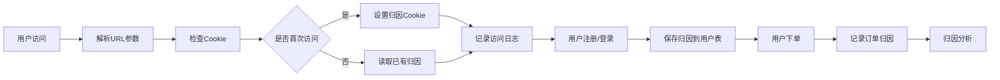

# 用户归因系统架构设计

## 一、系统概述

用户归因系统（User Attribution System）是一个完整的用户来源追踪和分析系统，旨在帮助产品团队了解：
- 用户从哪里来（流量来源）
- 用户使用什么设备（设备信息）
- 用户在哪里（地理位置）
- 用户的转化路径（从访问到付费）

## 二、架构设计

### 2.1 整体架构

```
┌─────────────────────────────────────────────────────────────┐
│                        前端层                                │
│  Cookie管理 │ UTM参数解析 │ Referrer追踪 │ 设备检测         │
├─────────────────────────────────────────────────────────────┤
│                      中间件层                                │
│  归因中间件 │ 访问记录中间件 │ 设备解析中间件               │
├─────────────────────────────────────────────────────────────┤
│                      服务层                                  │
│  归因服务 │ UA解析服务 │ IP地理服务 │ 数据分析服务         │
├─────────────────────────────────────────────────────────────┤
│                      数据层                                  │
│  用户表 │ 订单表 │ 归因记录表 │ 访问日志表                 │
└─────────────────────────────────────────────────────────────┘
```

### 2.2 数据流设计



## 三、数据模型设计

### 3.1 用户表扩展字段

```sql
-- 用户归因信息
attribution_source      VARCHAR(100)    -- 来源渠道 (google, baidu, direct, etc.)
attribution_medium      VARCHAR(100)    -- 媒介 (cpc, organic, social, referral)
attribution_campaign    VARCHAR(255)    -- 活动名称
attribution_term        VARCHAR(255)    -- 搜索关键词
attribution_content     VARCHAR(255)    -- 广告内容标识
attribution_landing     VARCHAR(500)    -- 着陆页URL
first_visit_at         TIMESTAMP       -- 首次访问时间
first_referrer         VARCHAR(500)    -- 首次来源页面
first_user_agent       TEXT            -- 首次访问UA
first_ip_address       VARCHAR(45)     -- 首次访问IP
first_country          VARCHAR(100)    -- 首次访问国家
first_region           VARCHAR(100)    -- 首次访问地区
first_city             VARCHAR(100)    -- 首次访问城市
first_device_type      VARCHAR(50)     -- 设备类型 (desktop, mobile, tablet)
first_os               VARCHAR(50)     -- 操作系统
first_browser          VARCHAR(50)     -- 浏览器
first_language         VARCHAR(10)     -- 浏览器语言
```

### 3.2 订单表扩展字段

```sql
-- 订单归因信息
order_source           VARCHAR(100)    -- 订单来源
order_medium           VARCHAR(100)    -- 订单媒介
order_campaign         VARCHAR(255)    -- 订单活动
order_device_type      VARCHAR(50)     -- 下单设备
order_os               VARCHAR(50)     -- 下单系统
order_browser          VARCHAR(50)     -- 下单浏览器
order_user_agent       TEXT            -- 下单UA
order_ip_address       VARCHAR(45)     -- 下单IP
order_country          VARCHAR(100)    -- 下单国家
order_region           VARCHAR(100)    -- 下单地区
order_city             VARCHAR(100)    -- 下单城市
order_page_url         VARCHAR(500)    -- 下单页面
order_session_id       VARCHAR(100)    -- 会话ID
```

### 3.3 访问日志表（新增）

```sql
CREATE TABLE visitor_logs (
    id                  SERIAL PRIMARY KEY,
    visitor_id          VARCHAR(100) NOT NULL,   -- 访客ID（未登录用户）
    user_uuid           VARCHAR(255),            -- 用户ID（已登录）
    session_id          VARCHAR(100) NOT NULL,   -- 会话ID
    visited_at          TIMESTAMP NOT NULL,      -- 访问时间
    page_url            VARCHAR(500),            -- 页面URL
    referrer            VARCHAR(500),            -- 来源页面
    
    -- UTM参数
    utm_source          VARCHAR(100),
    utm_medium          VARCHAR(100),
    utm_campaign        VARCHAR(255),
    utm_term            VARCHAR(255),
    utm_content         VARCHAR(255),
    
    -- 设备信息
    user_agent          TEXT,
    device_type         VARCHAR(50),
    os                  VARCHAR(50),
    os_version          VARCHAR(50),
    browser             VARCHAR(50),
    browser_version     VARCHAR(50),
    
    -- 地理位置
    ip_address          VARCHAR(45),
    country             VARCHAR(100),
    country_code        VARCHAR(10),
    region              VARCHAR(100),
    city                VARCHAR(100),
    timezone            VARCHAR(100),
    
    -- 其他
    language            VARCHAR(10),
    screen_resolution   VARCHAR(20),
    viewport_size       VARCHAR(20),
    color_depth         INTEGER,
    
    INDEX idx_visitor_id (visitor_id),
    INDEX idx_user_uuid (user_uuid),
    INDEX idx_session_id (session_id),
    INDEX idx_visited_at (visited_at)
);
```

## 四、核心功能模块

### 4.1 Cookie染色机制

```typescript
// Cookie结构设计
interface AttributionCookie {
  // 首次归因（first-touch）
  first: {
    source: string;      // 来源
    medium: string;      // 媒介
    campaign?: string;   // 活动
    term?: string;       // 关键词
    content?: string;    // 内容
    timestamp: number;   // 时间戳
    landing: string;     // 着陆页
  };
  
  // 最近归因（last-touch）
  last: {
    source: string;
    medium: string;
    campaign?: string;
    term?: string;
    content?: string;
    timestamp: number;
    landing: string;
  };
  
  // 访问信息
  visitor: {
    id: string;          // 访客ID
    sessionId: string;   // 会话ID
    visitCount: number;  // 访问次数
  };
}
```

### 4.2 UTM参数解析

支持标准UTM参数和自定义参数：
- `utm_source` - 流量来源
- `utm_medium` - 流量媒介
- `utm_campaign` - 营销活动
- `utm_term` - 搜索关键词
- `utm_content` - 广告内容
- `ref` - 自定义来源
- `f` - 简化来源标记

### 4.3 User Agent解析

从User Agent中提取：
- 设备类型（Desktop/Mobile/Tablet）
- 操作系统及版本
- 浏览器及版本
- 设备品牌和型号（移动设备）

### 4.4 IP地理位置解析

使用IP地理库获取：
- 国家和国家代码
- 省份/州
- 城市
- 时区
- ISP运营商

## 五、归因策略

### 5.1 归因模型

支持多种归因模型：

1. **首次触点归因（First-Touch）**
   - 归功于用户第一次接触的渠道
   - 适合分析品牌认知度

2. **最后触点归因（Last-Touch）**
   - 归功于转化前最后接触的渠道
   - 适合分析直接转化效果

3. **线性归因（Linear）**
   - 平均分配功劳给所有触点
   - 适合分析整体营销效果

4. **时间衰减归因（Time-Decay）**
   - 越接近转化的触点权重越大
   - 适合销售周期较长的产品

### 5.2 来源识别优先级

```
1. URL参数（utm_source、ref等）
2. Referrer（来源网站）
3. 搜索引擎识别
4. 社交媒体识别
5. Direct（直接访问）
```

## 六、分析维度

### 6.1 用户分析

- **获客渠道分析**
  - 各渠道新用户数量
  - 各渠道用户质量（留存、付费率）
  - 获客成本（CAC）

- **设备分析**
  - 设备类型分布
  - 操作系统分布
  - 浏览器分布

- **地理分析**
  - 用户地理分布
  - 各地区用户价值
  - 时区分析

### 6.2 转化分析

- **渠道转化率**
  - 各渠道注册转化率
  - 各渠道付费转化率
  - 渠道ROI分析

- **设备转化率**
  - PC vs 移动端转化
  - 不同OS的转化差异
  - 浏览器兼容性影响

- **路径分析**
  - 用户转化路径
  - 关键页面流失率
  - 多触点归因分析

## 七、技术实现要点

### 7.1 性能优化

1. **Cookie优化**
   - 使用httpOnly和secure标记
   - 合理设置过期时间（建议30天）
   - 压缩Cookie数据大小

2. **数据采集优化**
   - 异步采集，不阻塞页面加载
   - 批量上报，减少请求次数
   - 使用Web Beacon技术

3. **查询优化**
   - 添加合适的数据库索引
   - 使用缓存减少重复查询
   - 定期归档历史数据

### 7.2 隐私合规

1. **GDPR合规**
   - 获取用户同意
   - 提供数据删除选项
   - 数据最小化原则

2. **Cookie政策**
   - 明确告知Cookie使用
   - 提供Cookie管理选项
   - 支持Do Not Track

3. **数据安全**
   - 敏感数据加密存储
   - IP地址脱敏处理
   - 访问日志定期清理

## 八、实施计划

### Phase 1：基础归因（本次实施）
- [x] 数据库schema设计
- [ ] Cookie染色机制
- [ ] UTM参数解析
- [ ] 用户注册归因
- [ ] 订单归因记录

### Phase 2：高级分析
- [ ] 实时数据采集
- [ ] 多触点归因
- [ ] 转化漏斗分析
- [ ] 自定义报表

### Phase 3：智能优化
- [ ] 机器学习预测
- [ ] 自动化营销建议
- [ ] A/B测试集成
- [ ] ROI自动计算

## 九、监控与告警

### 9.1 关键指标监控

- 归因数据完整率
- Cookie设置成功率
- IP解析成功率
- 数据延迟情况

### 9.2 异常告警

- 归因数据异常波动
- 某渠道转化率异常
- 数据采集失败率过高
- Cookie被大量拒绝

## 十、总结

用户归因系统是产品增长的基础设施，通过精准的用户来源追踪和多维度分析，能够：

1. **优化营销投放** - 识别高价值渠道，优化预算分配
2. **提升转化率** - 分析转化路径，优化关键节点
3. **精准用户画像** - 了解用户特征，实现精准营销
4. **数据驱动决策** - 基于数据而非直觉做决策

本架构设计充分考虑了扩展性、性能和合规性，能够支撑产品从初创到规模化的全过程。