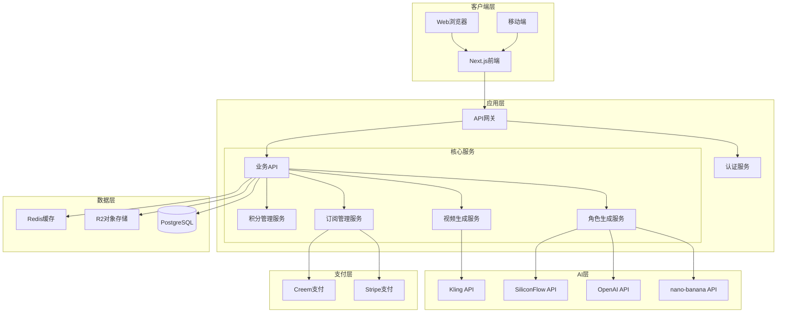
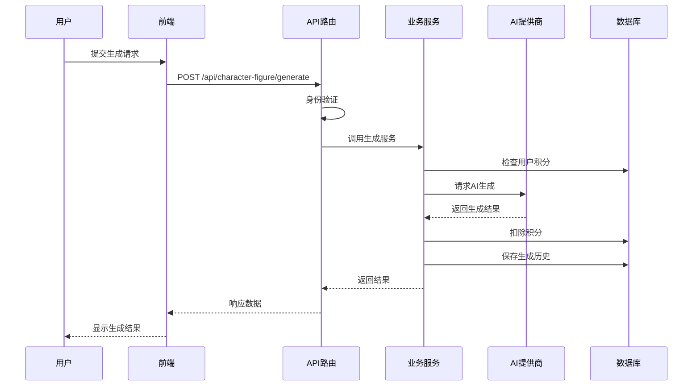
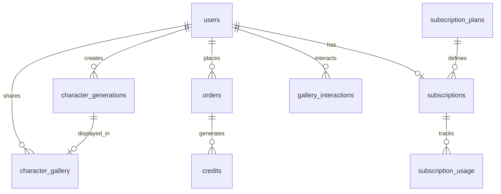
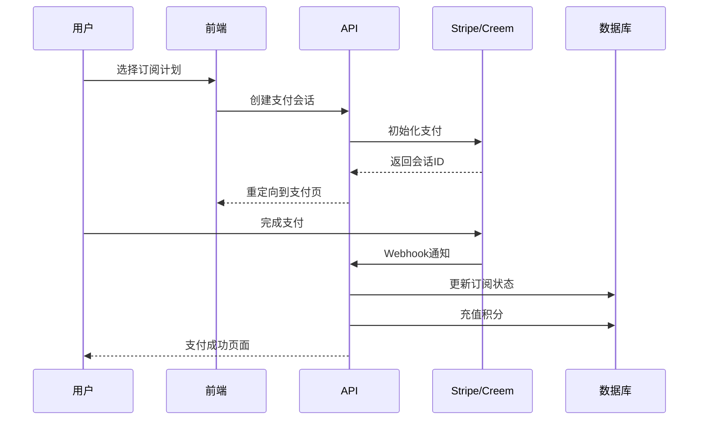
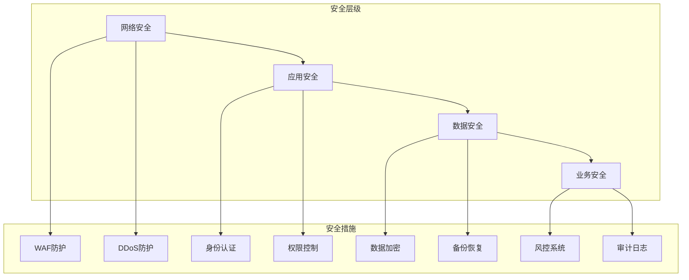
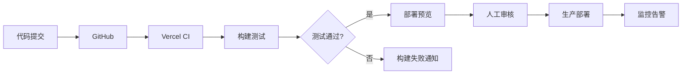

# nano-banana/Character Figure 项目架构分析报告

## 目录

1. [项目概述](#1-项目概述)
2. [技术架构](#2-技术架构)
3. [系统架构图](#3-系统架构图)
4. [核心模块分析](#4-核心模块分析)
5. [数据架构](#5-数据架构)
6. [API 路由设计](#6-api-路由设计)
7. [功能模块详解](#7-功能模块详解)
8. [技术亮点](#8-技术亮点)
9. [性能优化](#9-性能优化)
10. [安全设计](#10-安全设计)
11. [部署架构](#11-部署架构)
12. [总结与建议](#12-总结与建议)

---

## 1. 项目概述

### 1.1 项目定位

**nano-banana/Character Figure** 是一个基于 AI 的角色形象生成平台，专注于为创作者、游戏开发者和内容创作者提供高质量的角色设计服务。项目采用 SaaS 商业模式，通过订阅和积分系统实现盈利。

### 1.2 核心功能

- **AI 角色生成**：支持 10+ 种风格的角色形象生成
- **视频生成**：基于 Kling AI 的角色动画视频制作
- **画廊社区**：用户作品展示和社交互动
- **订阅系统**：分层定价的会员服务
- **API 服务**：开放 API 供第三方开发者集成

### 1.3 技术特色

- 基于 Next.js 15 的现代化架构
- 多 AI 提供商集成（OpenAI、DeepSeek、Kling、SiliconFlow）
- 完整的用户归因系统
- 企业级的安全和性能优化

---

## 2. 技术架构

### 2.1 技术栈概览

```
前端技术栈：
├── Framework: Next.js 15.2 (App Router)
├── Language: TypeScript 5.7
├── UI Library: shadcn/ui (Radix UI + Tailwind CSS 4.1)
├── State Management: React Context API
├── Styling: Tailwind CSS + CSS Modules
├── Animation: Framer Motion 11
└── Icons: Lucide React + Tabler Icons

后端技术栈：
├── Runtime: Node.js + Edge Runtime
├── API Framework: Next.js API Routes
├── Authentication: NextAuth.js 5.0
├── Database: PostgreSQL (Supabase)
├── ORM: Drizzle ORM
├── File Storage: Cloudflare R2
└── Cache: Vercel Edge Cache

AI 集成：
├── OpenAI SDK
├── DeepSeek SDK
├── Kling SDK (自定义实现)
├── SiliconFlow Integration
├── OpenRouter Provider
└── Replicate SDK

支付系统：
├── Stripe SDK 17.5
└── Creem Integration 0.3.37

部署与运维：
├── Hosting: Vercel
├── CDN: Vercel Edge Network
├── Monitoring: OpenPanel Analytics
└── Container: Docker支持
```

### 2.2 架构模式

项目采用 **三层架构（Three-tier Architecture）** 设计：

```
┌─────────────────────────────────────────────────────┐
│            Presentation Layer (表现层)               │
│  Next.js Pages, React Components, UI Elements       │
│  负责：用户界面渲染、交互处理、状态管理                  │
└─────────────────────────────────────────────────────┘
                        ↕ HTTP/WebSocket
┌─────────────────────────────────────────────────────┐
│         Business Logic Layer (业务逻辑层)            │
│    Services, API Routes, Business Rules             │
│  负责：业务规则、AI调用、支付处理、权限控制               │
└─────────────────────────────────────────────────────┘
                        ↕ SQL/ORM
┌─────────────────────────────────────────────────────┐
│          Data Access Layer (数据访问层)              │
│    Models, Database Operations, Type Definitions    │
│  负责：数据持久化、查询优化、事务管理                    │
└─────────────────────────────────────────────────────┘
```

---

## 3. 系统架构图

### 3.1 整体架构图



### 3.2 数据流架构



---

## 4. 核心模块分析

### 4.1 目录结构

```
/src
├── app/                    # Next.js App Router
│   ├── [locale]/          # 国际化路由
│   │   ├── (default)/     # 公开页面
│   │   ├── (admin)/       # 管理后台
│   │   └── auth/          # 认证页面
│   └── api/               # API端点
│       ├── character-figure/  # 角色生成API
│       ├── nano-banana/       # nano-banana集成
│       ├── subscription/      # 订阅管理
│       └── pay/              # 支付回调
│
├── services/              # 业务逻辑层
│   ├── character-figure.ts    # 角色生成服务
│   ├── video-generation.ts    # 视频生成服务
│   ├── subscription.ts        # 订阅服务
│   ├── credit.ts             # 积分服务
│   └── nano-banana.ts        # nano-banana服务
│
├── models/                # 数据模型层
│   ├── user.ts               # 用户模型
│   ├── order.ts              # 订单模型
│   ├── credit.ts             # 积分模型
│   └── character-figure.ts   # 角色模型
│
├── components/            # React组件
│   ├── ui/                  # 基础UI组件
│   ├── blocks/              # 页面区块
│   └── character-figure/    # 角色功能组件
│
├── aisdk/                 # AI SDK集成
│   ├── kling/               # Kling视频生成
│   ├── generate-video/      # 视频生成工具
│   └── provider/           # AI提供商抽象
│
├── db/                    # 数据库配置
│   ├── schema.ts            # 数据库模式
│   └── migrations/          # 数据库迁移
│
└── types/                 # TypeScript类型定义
    ├── character-figure.d.ts # 角色类型
    ├── video.d.ts           # 视频类型
    └── nano-banana.d.ts     # nano-banana类型
```

### 4.2 核心服务模块

#### 4.2.1 角色生成服务 (character-figure.ts)

```typescript
核心功能：
- 提示词增强和优化
- 多风格支持（动漫、写实、卡通等10+种）
- 批量生成管理
- 生成历史追踪
- 画廊集成

技术特点：
- 智能提示词优化算法
- 并发生成控制
- 失败重试机制
- 结果缓存优化
```

#### 4.2.2 视频生成服务 (video-generation.ts)

```typescript
创新工作流：
1. 使用nano-banana生成高质量首帧
2. 使用nano-banana生成控制尾帧
3. 使用Kling AI进行帧间插值
4. 合成最终视频

特色功能：
- 多种转场效果
- 摄像机运动控制
- 动作强度调节
- 多种视频风格
```

#### 4.2.3 订阅管理服务 (subscription.ts)

```typescript
订阅层级：
- FREE: 每日1次免费体验
- TRIAL: $3.99一次性10次生成包
- PRO: $10.99/月，50次生成
- ULTRA: $34.99/月，200次生成+商用授权

核心功能：
- 自动续费管理
- 使用量追踪
- 升级/降级处理
- 支付集成
```

---

## 5. 数据架构

### 5.1 数据库设计

#### 5.1.1 核心表结构

```sql
-- 用户表（包含完整归因字段）
users: {
  基础信息: id, uuid, email, nickname, avatar_url
  登录信息: signin_type, signin_provider, signin_openid
  邀请系统: invite_code, invited_by, is_affiliate
  归因追踪: attribution_source, medium, campaign等17个字段
  首次访问: first_visit_at, first_referrer, first_ip等
}

-- 订阅表
subscriptions: {
  用户关联: user_uuid, user_email
  计划信息: plan_id, plan_name, status
  计费信息: interval, price, currency
  时间管理: started_at, current_period_start/end
  使用限制: monthly_limit, used_this_month
  支付集成: stripe_subscription_id, stripe_customer_id
}

-- 角色生成历史表
character_generations: {
  基础信息: id, uuid, user_uuid, created_at
  生成参数: prompt, style, pose, gender, age等
  生成结果: generated_images, generation_time, credits_used
  nano-banana集成: nano_banana_request_id, response
  用户操作: is_favorited, is_deleted, gallery_item_id
}

-- 画廊表
character_gallery: {
  展示信息: title, description, tags
  图像信息: image_url, thumbnail_url, dimensions
  社交统计: likes_count, views_count, bookmarks_count
  状态管理: is_public, is_featured, is_approved
}

-- 订单表
orders: {
  订单信息: order_no, amount, status, currency
  订阅相关: interval, sub_id, sub_cycle_anchor
  支付信息: stripe_session_id, paid_at, paid_detail
  归因字段: order_source, medium, campaign等12个字段
}
```

#### 5.1.2 数据关系



### 5.2 数据流设计

#### 5.2.1 用户归因数据流

```
用户访问 → 捕获UTM参数 → 存储首次访问信息 → 追踪转化路径 → 分析ROI
```

#### 5.2.2 生成请求数据流

```
请求验证 → 积分检查 → AI调用 → 结果存储 → 积分扣除 → 历史记录
```

---

## 6. API 路由设计

### 6.1 RESTful API 结构

```typescript
// 角色生成相关
POST   /api/character-figure/generate     // 生成角色
GET    /api/character-figure/history      // 获取历史
GET    /api/character-figure/gallery      // 画廊列表
POST   /api/character-figure/gallery/:id/action // 点赞/收藏

// 视频生成相关
POST   /api/character-figure/video        // 生成视频
GET    /api/character-figure/video/:id    // 查询状态

// 订阅管理
GET    /api/subscription                  // 获取订阅状态
POST   /api/subscription                  // 创建/更新订阅
DELETE /api/subscription                  // 取消订阅

// 支付处理
POST   /api/checkout                      // 创建支付会话
POST   /api/pay/notify/stripe            // Stripe webhook
POST   /api/pay/notify/creem             // Creem webhook

// nano-banana集成
POST   /api/nano-banana/generate         // 直接调用nano-banana
POST   /api/nano-banana/edit            // 编辑生成参数

// 用户归因
POST   /api/attribution/track           // 追踪用户行为
GET    /api/attribution/analytics       // 获取分析数据
```

### 6.2 API 安全设计

```typescript
安全措施：
1. NextAuth.js身份验证
2. Rate Limiting速率限制
3. CORS策略配置
4. Input验证和消毒
5. SQL注入防护
6. XSS防护
7. CSRF令牌验证
```

---

## 7. 功能模块详解

### 7.1 角色生成模块

#### 7.1.1 风格系统

```typescript
支持的风格：
- ANIME: 高质量动漫艺术风格
- REALISTIC: 照片级写实风格
- CARTOON: 风格化卡通风格
- FANTASY: 魔幻奇幻风格
- CYBERPUNK: 赛博朋克风格
- STEAMPUNK: 蒸汽朋克风格
- MEDIEVAL: 中世纪风格
- MODERN: 现代风格
- SCI_FI: 科幻风格
- CHIBI: Q版萌系风格
```

#### 7.1.2 智能提示词优化

```typescript
优化流程：
1. 基础提示词分析
2. 风格关键词注入
3. 质量增强词添加
4. 负面提示词配置
5. 参数微调优化
```

### 7.2 视频生成模块

#### 7.2.1 双帧控制技术

```typescript
创新点：
- 首帧控制：使用nano-banana生成高质量起始帧
- 尾帧控制：精确控制视频结束状态
- 智能插值：Kling AI进行平滑过渡
- 风格一致性：确保全程视觉统一
```

#### 7.2.2 视频参数

```typescript
可配置项：
- 时长: 3秒/5秒/10秒
- 宽高比: 16:9/9:16/1:1/4:3
- 帧率: 24/30/60 fps
- 质量: 标准/高清/专业
- 运动强度: 低/中/高
- 摄像机运动: 平移/缩放/环绕
```

### 7.3 订阅和支付系统

#### 7.3.1 订阅定价策略

```typescript
价值锚点设计：
- FREE: 建立使用习惯，每日1次
- TRIAL: $3.99体验包，单价$0.399/次
- PRO: $10.99月付，单价$0.22/次
- ULTRA: $34.99月付，单价$0.17/次+商用授权

年付优惠：
- PRO年付省2个月
- ULTRA年付省2个月
```

#### 7.3.2 支付流程



### 7.4 多语言和SEO

#### 7.4.1 国际化实现

```typescript
支持语言：
- 英语 (en) - 默认
- 中文 (zh)
- 日语 (ja)
- 西班牙语 (es)
- 法语 (fr)
- 德语 (de)

实现方式：
- next-intl国际化框架
- URL路径前缀策略
- 自动语言检测
- Cookie持久化
```

#### 7.4.2 SEO优化

```typescript
SEO策略：
1. 动态sitemap.xml生成
2. 结构化数据标记
3. Open Graph元标签
4. Twitter Card支持
5. 多语言URL映射
6. 页面性能优化
7. 移动端优化
8. Core Web Vitals优化
```

---

## 8. 技术亮点

### 8.1 创新功能

#### 8.1.1 用户归因系统

```typescript
追踪维度：
- UTM参数: source, medium, campaign, term, content
- 设备信息: 类型, 操作系统, 浏览器
- 地理位置: 国家, 地区, 城市
- 行为路径: 着陆页, 转化漏斗
- 时间维度: 首次访问, 注册, 付费

应用场景：
- ROI分析
- 营销优化
- 用户画像
- 转化归因
```

#### 8.1.2 智能速率限制

```typescript
限流策略：
- FREE用户: 5次/小时
- PRO用户: 20次/小时
- ULTRA用户: 50次/小时

实现特点：
- 基于用户等级的动态限流
- 滑动窗口算法
- 优雅降级处理
- 详细错误信息
```

#### 8.1.3 混合AI策略

```typescript
AI提供商选择：
- 主力: nano-banana (角色生成)
- 备选: OpenAI (通用生成)
- 视频: Kling (视频生成)
- 增强: SiliconFlow (风格迁移)

智能路由：
- 根据任务类型选择
- 失败自动切换
- 成本优化
- 质量保证
```

### 8.2 性能优化

#### 8.2.1 前端优化

```typescript
优化措施：
- 代码分割和懒加载
- 图片优化(WebP, AVIF)
- 预加载关键资源
- Service Worker缓存
- Virtual DOM优化
- 骨架屏加载
```

#### 8.2.2 后端优化

```typescript
优化策略：
- Edge Runtime部署
- 数据库连接池
- SQL查询优化
- Redis缓存层
- CDN静态资源
- API响应压缩
```

### 8.3 安全特性

```typescript
安全措施：
1. 身份验证: NextAuth.js + JWT
2. 授权控制: RBAC权限模型
3. 数据加密: TLS传输 + 存储加密
4. 输入验证: Zod schema验证
5. SQL注入防护: 参数化查询
6. XSS防护: 内容消毒
7. CSRF防护: 双重Cookie验证
8. 速率限制: 防止滥用
9. 安全响应头: Helmet.js配置
10. 审计日志: 关键操作记录
```

---

## 9. 性能优化

### 9.1 性能指标

```typescript
目标指标：
- 首屏加载: < 2秒
- 交互响应: < 100ms
- API响应: < 500ms
- 生成耗时: < 10秒
- 可用性: > 99.9%
```

### 9.2 优化策略

#### 9.2.1 缓存策略

```typescript
多级缓存：
1. 浏览器缓存: 静态资源缓存
2. CDN缓存: 全球边缘节点
3. Redis缓存: 热点数据缓存
4. 数据库缓存: 查询结果缓存
5. 应用缓存: 内存缓存
```

#### 9.2.2 数据库优化

```sql
优化措施：
- 索引优化: 关键字段建立索引
- 查询优化: 避免N+1查询
- 分页查询: 游标分页
- 读写分离: 主从复制
- 定期维护: VACUUM和ANALYZE
```

#### 9.2.3 图片优化

```typescript
图片处理：
- 格式转换: WebP/AVIF
- 响应式图片: srcset
- 懒加载: Intersection Observer
- CDN分发: 全球加速
- 压缩优化: 质量vs大小平衡
```

---

## 10. 安全设计

### 10.1 安全架构



### 10.2 安全最佳实践

```typescript
实施措施：
1. 安全开发生命周期(SDL)
2. 代码安全审计
3. 依赖漏洞扫描
4. 渗透测试
5. 安全事件响应
6. 数据脱敏
7. 最小权限原则
8. 安全配置基线
```

---

## 11. 部署架构

### 11.1 部署环境

```yaml
生产环境：
  平台: Vercel
  区域: 全球边缘网络
  数据库: Supabase (PostgreSQL)
  存储: Cloudflare R2
  CDN: Vercel Edge Network
  
开发环境：
  本地: Next.js dev server
  数据库: 本地PostgreSQL
  
测试环境：
  平台: Vercel Preview
  数据库: Supabase测试实例
```

### 11.2 CI/CD流程



### 11.3 容器化部署

```dockerfile
Docker支持：
- 基础镜像: node:20-alpine
- 多阶段构建
- 层缓存优化
- 安全扫描
- 环境变量管理
```

---

## 12. 总结与建议

### 12.1 架构优势

1. **技术先进性**
   - 采用最新的Next.js 15和React 19
   - TypeScript全栈类型安全
   - 现代化的开发工具链

2. **可扩展性**
   - 模块化的服务设计
   - 清晰的分层架构
   - 灵活的AI提供商集成

3. **商业价值**
   - 完整的SaaS功能闭环
   - 多样化的盈利模式
   - 数据驱动的运营支持

4. **用户体验**
   - 快速的响应速度
   - 直观的操作流程
   - 丰富的个性化选项

### 12.2 改进建议

#### 12.2.1 技术优化

```typescript
建议实施：
1. 引入GraphQL提升API效率
2. 实现WebSocket实时通信
3. 添加Service Worker离线支持
4. 集成更多AI提供商
5. 实现分布式任务队列
```

#### 12.2.2 功能扩展

```typescript
潜在功能：
1. AI模型训练平台
2. 团队协作功能
3. 模板市场
4. API市场
5. 移动端应用
```

#### 12.2.3 运营优化

```typescript
运营建议：
1. A/B测试框架
2. 用户行为分析
3. 自动化营销
4. 社区运营工具
5. 内容管理系统
```

### 12.3 技术债务

```typescript
需要关注：
1. 测试覆盖率提升
2. 文档完善
3. 错误监控增强
4. 性能监控细化
5. 安全审计定期化
```

### 12.4 未来展望

项目展现了强大的技术实力和商业潜力，通过持续的技术创新和用户体验优化，有望成为AI角色生成领域的领先平台。建议重点关注：

1. **AI技术演进**：持续跟进AI技术发展，集成最新模型
2. **用户增长**：通过数据分析优化获客和留存
3. **生态建设**：构建开发者生态和内容创作者社区
4. **国际化扩展**：深化多语言支持，拓展全球市场
5. **合规性**：关注数据保护法规，确保合规运营

---

## 附录

### A. 技术词汇表

- **SaaS**: Software as a Service，软件即服务
- **SSR**: Server-Side Rendering，服务端渲染
- **ISR**: Incremental Static Regeneration，增量静态再生
- **PWA**: Progressive Web App，渐进式网络应用
- **CDN**: Content Delivery Network，内容分发网络
- **WAF**: Web Application Firewall，网络应用防火墙
- **RBAC**: Role-Based Access Control，基于角色的访问控制
- **JWT**: JSON Web Token，JSON网络令牌
- **ORM**: Object-Relational Mapping，对象关系映射

### B. 相关资源

- [Next.js文档](https://nextjs.org/docs)
- [Vercel部署指南](https://vercel.com/docs)
- [Supabase文档](https://supabase.com/docs)
- [Stripe集成指南](https://stripe.com/docs)
- [shadcn/ui组件库](https://ui.shadcn.com)

### C. 版本历史

- v2.6.0 - 当前版本，集成nano-banana和Character Figure功能
- v2.5.0 - 添加视频生成功能
- v2.4.0 - 实现订阅系统
- v2.3.0 - 集成多AI提供商
- v2.2.0 - 添加用户归因系统

---

*文档编写日期：2025年8月28日*
*作者：架构团队*
*版本：1.0.0*